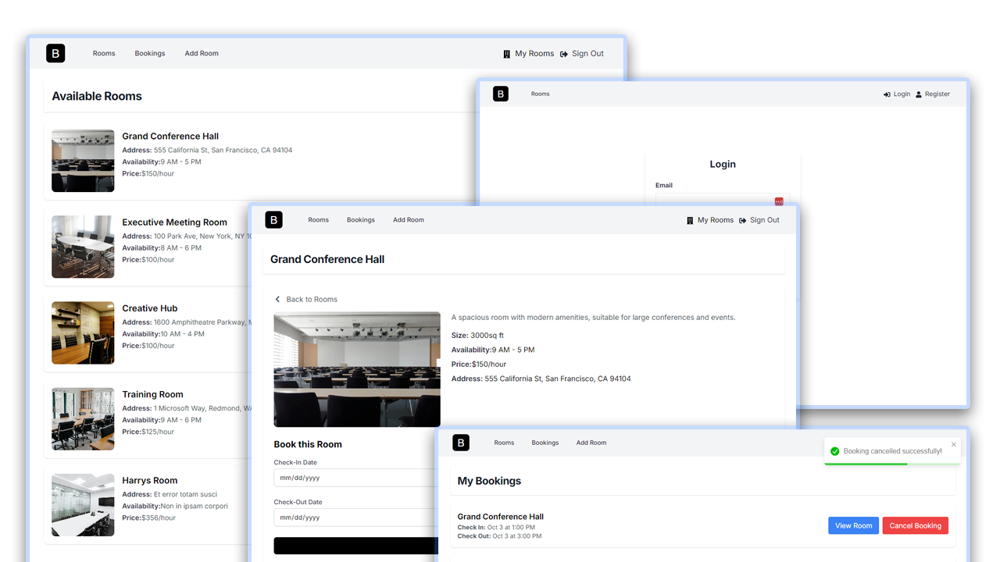

<div align="center">
  <br />
    
  <br />

  <div>
     
    
    
  </div>

<h3 align="center">BookIT | Meeting Room Booking Application</h3>
</div>

## 📋 <a name="table">Table of Contents</a>

1. 🤖 [Introduction](#introduction)
2. ⚙️ [Tech Stack](#tech-stack)
3. 🔋 [Features](#features)
4. 🤸 [Quick Start](#quick-start)


## <a name="tech-stack">⚙️ Tech Stack</a>

- React 19
- Next.js 15
- Appwrite
- TailwindCSS

## <a name="features">🔋 Features</a>

👉 **User Authentication with Appwrite**: Implement signup, login, and logout functionality using Appwrite's authentication system.

👉 **View and Manage Rooms**: Users can browse through their meeting rooms, schedule and book a meeting room.

👉 **Create Rooms**: Authenticated users can create meeting rooms.

👉 **Delete Rooms**: Authenticated users can delete rooms that belong to them.


## <a name="quick-start">🤸 Quick Start</a>

Follow these steps to set up the project locally on your machine.

**Prerequisites**

Make sure you have the following installed on your machine:

- [Git](https://git-scm.com/)
- [Node.js](https://nodejs.org/en)
- [npm](https://www.npmjs.com/) (Node Package Manager)

**Cloning the Repository**

```bash
git clone https://github.com/Damjan15/BookIT
cd bookit
```

**Installation**

Install the project dependencies using npm:

```bash
npm install
```

**Set Up Environment Variables**

Create a new file named `.env.local` in the root of your project and add the following content:

```env
NEXT_PUBLIC_APPWRITE_ENDPOINT=
NEXT_PUBLIC_APPWRITE_PROJECT=""
NEXT_PUBLIC_APPWRITE_DATABASE=""
NEXT_PUBLIC_APPWRITE_COLLECTION_ROOMS=
NEXT_PUBLIC_APPWRITE_STORAGE_BUCKET_ROOMS=
NEXT_PUBLIC_APPWRITE_COLLECTION_BOOKINGS=
```

Replace the values with your actual Appwrite credentials. You can obtain these credentials by signing up &
creating a new project on the [Appwrite website](https://appwrite.io/).

**Running the Project**

```bash
npm run dev
```

Open [http://localhost:3000](http://localhost:3000) in your browser to view the project.
